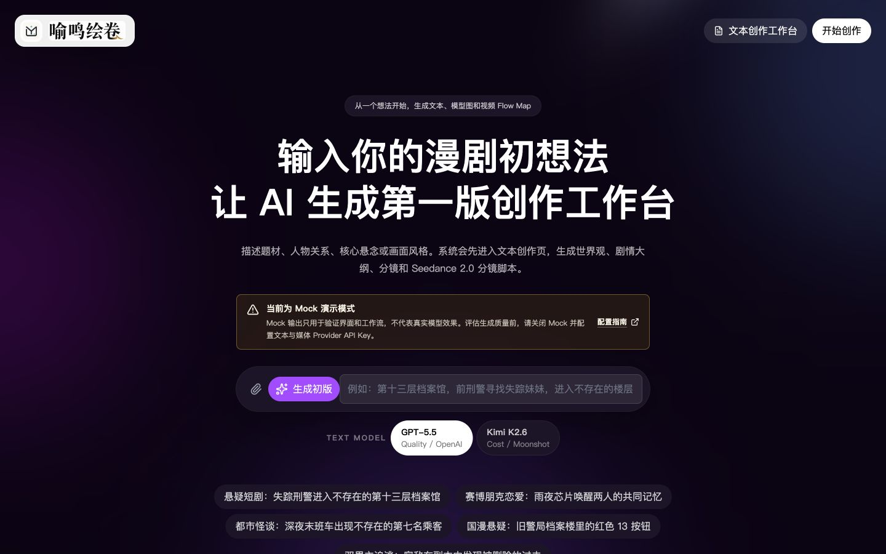
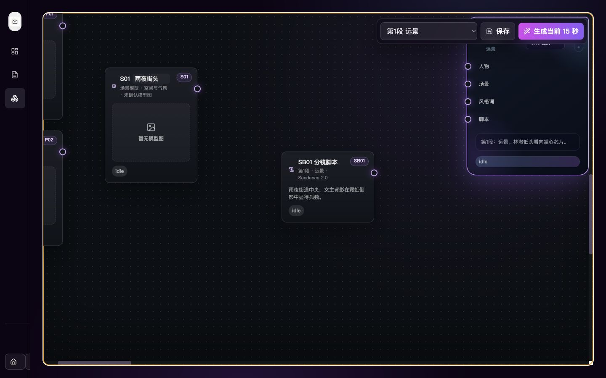
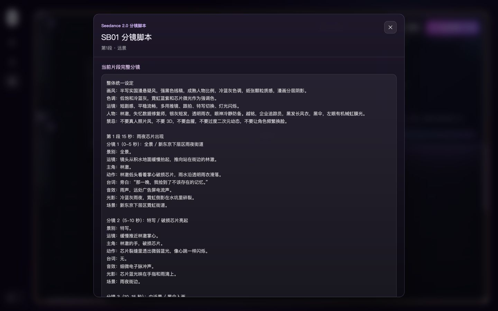

# 喻鸣绘卷 / Yuming Scroll

[](https://github.com/tansuanyl/YumingScroll/actions/workflows/ci.yml)
[](./LICENSE)

喻鸣绘卷是一个可自托管的 AI 漫剧创作工作台，把故事文本、人物与场景模型、分镜脚本、Flow Map、图片和视频资产组织在同一个项目中。

> [!IMPORTANT]
> **请在评估生成效果前配置真实 AI Provider API Key。** Mock 模式只返回用于验证界面和工作流的示例结果，不代表 OpenAI、Kimi、Seedance 或其他真实模型的生成质量。API Key 必须配置在服务端环境变量中，不能放进浏览器或 `NEXT_PUBLIC_*` 变量。

项目当前处于早期开发阶段。真实生成需要部署者自己的模型服务账号，并可能产生第三方 API 费用。

## 实机画面

> 以下截图使用 Mock 演示数据，不包含真实 API Key 或用户数据。

### 从一句想法开始



### 文本创作工作台


### 视频 Flow Map



### Seedance 2.0 分镜脚本



## 功能

- 从一句灵感或导入的小说/文档生成世界观、人物、剧情大纲和分镜
- 生成人物模型、场景模型和片段构图参考图
- 用 Flow Map 连接人物、场景、画风和当前 15 秒脚本
- 生成并恢复异步视频任务，管理相邻片段的连续性
- 在 Gallery 中预览、复用、下载和删除项目资产
- 支持中文与英文界面切换，并在浏览器中保存语言选择
- 无需注册或登录，打开本地工作台即可使用
- 支持本地 JSON 或 PostgreSQL 项目存储
- 支持本地磁盘或 S3-compatible 媒体存储

## 技术栈

- Web：Next.js 16、React 19、TypeScript
- API：NestJS 11
- 数据：Prisma 7、PostgreSQL，或本地 JSON
- 媒体：本地磁盘或 S3-compatible storage
- 文本模型：OpenAI、Moonshot/Kimi 或 OpenAI-compatible endpoint
- 图片/视频：Seedance/Volcengine Ark、fal 或兼容接口

## 快速开始

环境要求：Node.js 22+、npm 10+。

```bash
git clone https://github.com/tansuanyl/YumingScroll.git
cd YumingScroll
npm ci
cp .env.example .env
```

### 推荐：配置真实 Provider 后体验

要评估项目的实际生成效果，请先在 `.env` 中关闭 Mock，并至少配置一个文本 Provider；图片和视频生成还需要媒体 Provider：

```env
APP_ENV=local
DATABASE_URL=
MOCK_PROVIDERS=false

# 文本生成：OpenAI 与 Moonshot/Kimi 至少配置一个
OPENAI_MOCK=false
OPENAI_API_KEY=your-openai-api-key
MOONSHOT_API_KEY=

# 图片与视频生成
SEEDANCE_MOCK=false
SEEDANCE_API_KEY=your-seedance-api-key
```

不要把填写过真实 Key 的 `.env` 提交到 Git。模型、兼容接口和更多变量说明见[配置真实 AI 服务](#配置真实-ai-服务)。

启动 Web 和 API：

```bash
npm run dev
```

- Web：`http://127.0.0.1:5173`
- API：`http://127.0.0.1:8787`
- 健康检查：`http://127.0.0.1:8787/api/health`

打开 Web 地址即可直接进入工作台，无需注册或登录。首页会检查文本与媒体 Provider 状态：所选文本模型未配置时会阻止生成；Mock 或媒体未配置时会明确提示。

### 仅验证界面与流程：Mock 模式

没有 Provider 账号时，可以把 `.env` 调整为零密钥 Mock 模式：

```env
MOCK_PROVIDERS=true
OPENAI_MOCK=true
SEEDANCE_MOCK=true
```

Mock 模式不会调用外部模型，只返回结构化示例结果。请勿用这些结果评价项目的文本、图片或视频生成质量。

## PostgreSQL 模式

启动本地 PostgreSQL 并执行迁移：

```bash
npm run db:up
npm run db:deploy
npm run dev
```

`.env.example` 默认使用本地 PostgreSQL。将 `DATABASE_URL` 留空时，项目数据改用本地 JSON 文件，适合个人本地使用。

## 配置真实 AI 服务

仓库不内置任何模型 API Key。每个部署者必须在自己的服务端环境中配置 Key；浏览器端只调用本项目 API，不接收、不保存也不转发用户输入的 Key。不要创建 `NEXT_PUBLIC_OPENAI_*`、`VITE_OPENAI_*` 或其他公开 Key 变量。

未配置 Key 时，对应 Provider 状态会返回 `unconfigured`，生成请求会明确提示缺少哪个服务端变量，不会静默使用示例结果。只有显式设置 `MOCK_PROVIDERS=true`、`OPENAI_MOCK=true` 或 `SEEDANCE_MOCK=true` 才会启用 Mock。

文本生成的基本配置：

```env
OPENAI_MOCK=false
OPENAI_API_KEY=
OPENAI_MODEL=gpt-5.5
OPENAI_BASE_URL=
OPENAI_API_MODE=responses

MOONSHOT_API_KEY=
MOONSHOT_MODEL=kimi-k2.6
MOONSHOT_BASE_URL=https://api.moonshot.cn/v1
```

图片和视频生成的基本配置：

```env
SEEDANCE_MOCK=false
SEEDANCE_API_KEY=
SEEDANCE_PROVIDER=ark
SEEDANCE_BASE_URL=https://ark.cn-beijing.volces.com/api/v3
SEEDANCE_IMAGE_MODEL=doubao-seedream-4-0-250828
SEEDANCE_VIDEO_MODEL=doubao-seedance-2-0-260128
```

软件本身不提供 coins/token 计费，也不收取生成费用。模型名称、接口能力和费用可能随第三方 Provider 变化，调用费用由部署者自己的 Provider 账号承担。请遵守相应条款、内容政策和数据保留规则。

配置完成后重启 API 服务。可通过 `/api/text/provider-status` 和 `/api/media/provider-status` 检查状态；响应只包含 `configured`、模式和模型信息，不会返回 Key。

## 媒体存储

生产环境建议使用 S3-compatible 存储，详见 [媒体存储文档](./docs/media-storage.md)。

## 验证

```bash
npm run typecheck
npm test
npm run build
npm run verify:client-secrets
npm audit
```

CI 会在 push 和 pull request 中执行类型检查、测试、构建、依赖审计和浏览器密钥扫描。

## 项目结构

```text
app/                 Next.js 页面与同域 API 代理
src/components/      工作台、Gallery 和 Flow Map 界面
src/lib/             前端状态、连接关系和项目资产逻辑
server/nest/         NestJS controllers 和错误处理
server/services/     文本、媒体、存储和项目服务
server/providers/    OpenAI 与图片/视频 Provider 适配器
prisma/              Schema 与 migrations
tests/               Vitest 单元和集成测试
docs/                部署、存储和提示框架文档
```

## 部署

- 通用前后端分离方案：[部署架构](./docs/deployment-architecture.md)
- 腾讯云部署：[腾讯云部署说明](./docs/tencent-cloud-deployment.md)
- GitHub Actions 手动部署：[CVM Actions 部署](./docs/github-actions-deployment.md)

这个版本按单用户自托管场景设计，没有内置账户或访问控制。部署到公网前请自行在反向代理或私有网络层增加访问保护，并配置 HTTPS、持久数据库和持久媒体存储。不要把 `.env`、数据库、上传文件或生成素材提交到 Git。

## 隐私与安全

- 应用内隐私政策页面位于 `/privacy`；运营者应按实际部署、联系方式和第三方服务修改内容
- 安全问题请按 [SECURITY.md](./SECURITY.md) 私下报告
- 参与贡献前请阅读 [CONTRIBUTING.md](./CONTRIBUTING.md) 和 [CODE_OF_CONDUCT.md](./CODE_OF_CONDUCT.md)

## 许可证

软件源代码采用 [GNU Affero General Public License v3.0 only](./LICENSE)。修改后通过网络提供服务时，需要向这些服务用户提供对应版本的源代码。

用户输入和用户生成的小说、Prompt、图片、音频及视频不会因为使用本软件而自动适用 AGPL。项目名称、Logo 和品牌素材不随软件代码授权，详见 [TRADEMARKS.md](./TRADEMARKS.md)；第三方组件说明见 [THIRD_PARTY_NOTICES.md](./THIRD_PARTY_NOTICES.md)。
